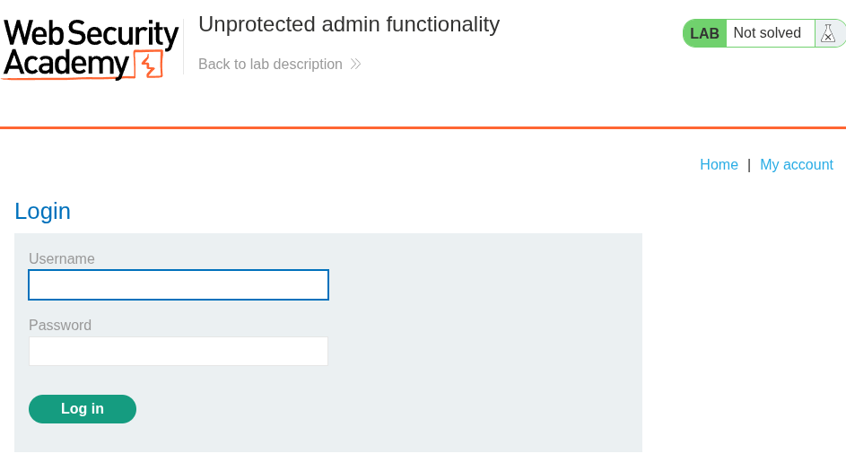
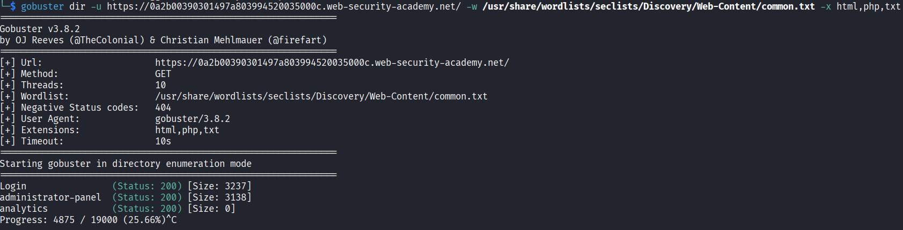
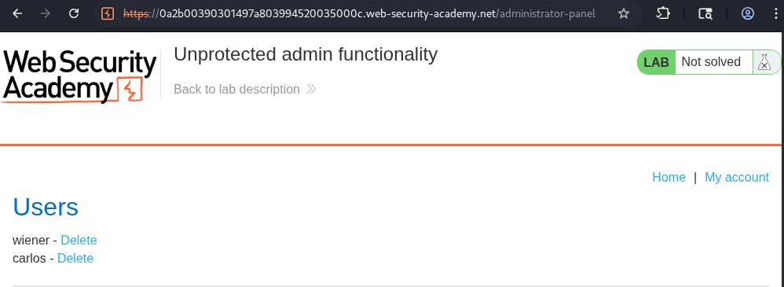
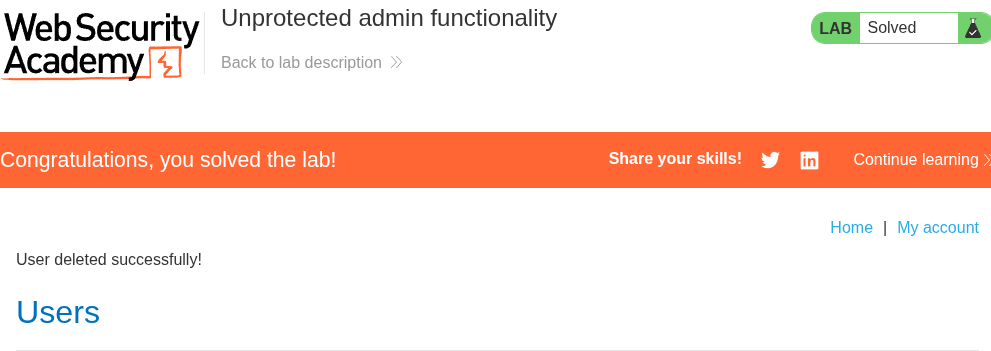

# Lab: Unprotected admin functionality

## Objetivo

Eliminar al usuario carlos

## Información dada

* Panel administrativo desprotegido

## Reconocimiento

EL sitio dispone de una pagina de inicio de sesion

---

## Enumeracion

Para la busqueda de recursos y directorios se realizo una enumeracion donde se descubrio la pagina de `administrator-panel`:

...

## Explotacion

El acceso a la pagina de `/administrator-panel` no solicito ningun metodo de autenticacion , lo que permitio utilizar la funcionalidad para la eliminación de usuarios 

