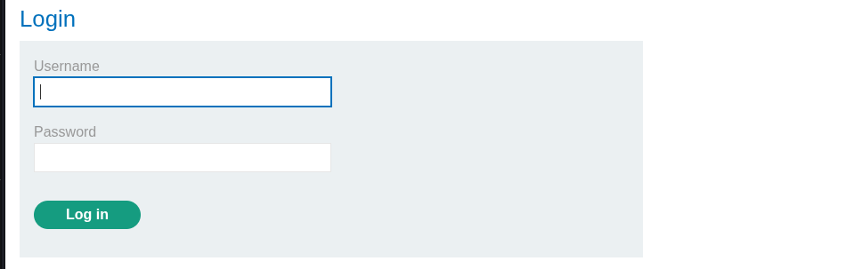
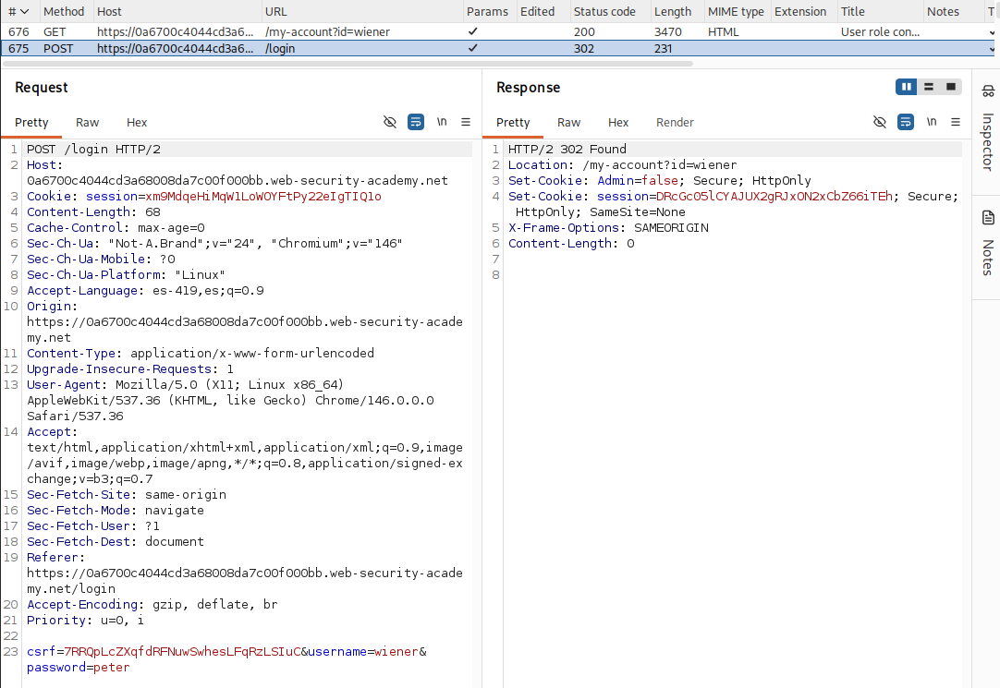
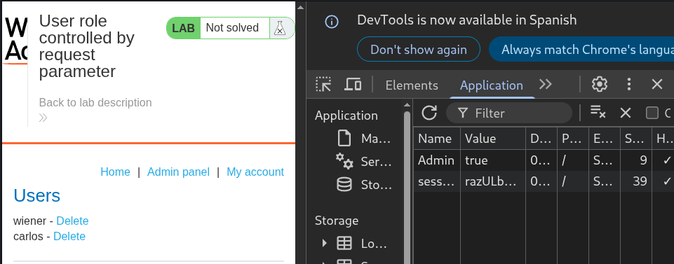
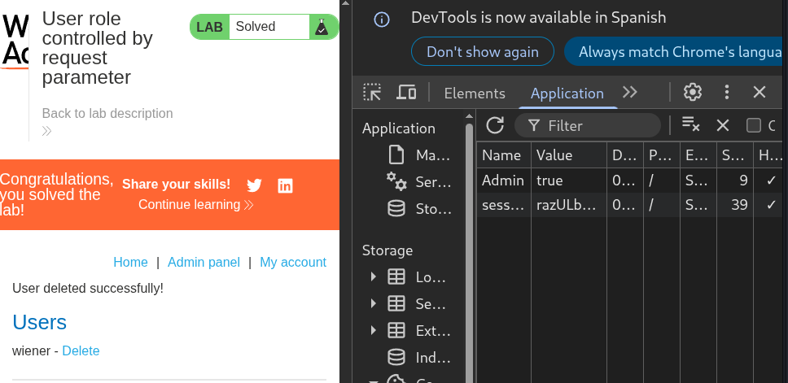

# Lab: User role controlled by request parameter

## Objetivo

Eliminar al usuario carlos

## Información dada

* Cookie para la identificacion de usuarios administradores
* Credenciales -> wiener:peter

## Reconocimiento

EL sitio disponia de una pagina de inicio de sesion

Tras el inicio de sesision con las credenciales de `wiener:peter`, la respuesta vino acompañada con las cookies de `session` y `Admin`

---

## Explotacion

Tras modificar el valor de la cookie `Admin` y renviar la solicitud,  la pagina habilito el enlace al panel administrativo.

El panel administrativo fue accesible sin la nesecidad de credenciales administrativas a causa la cookie `Admin`

Eliminacion de usuario:

