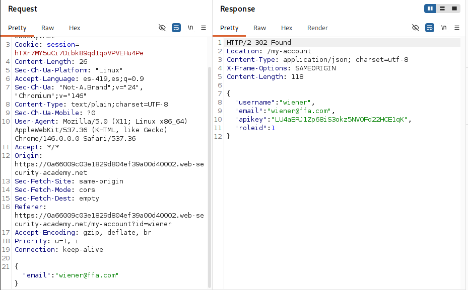
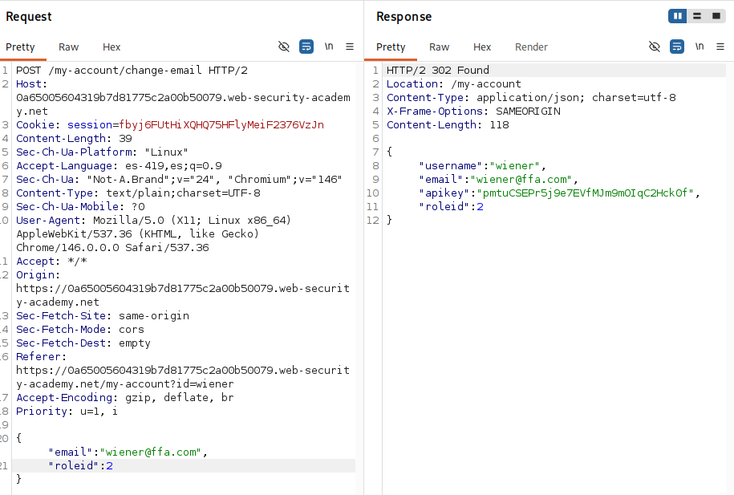
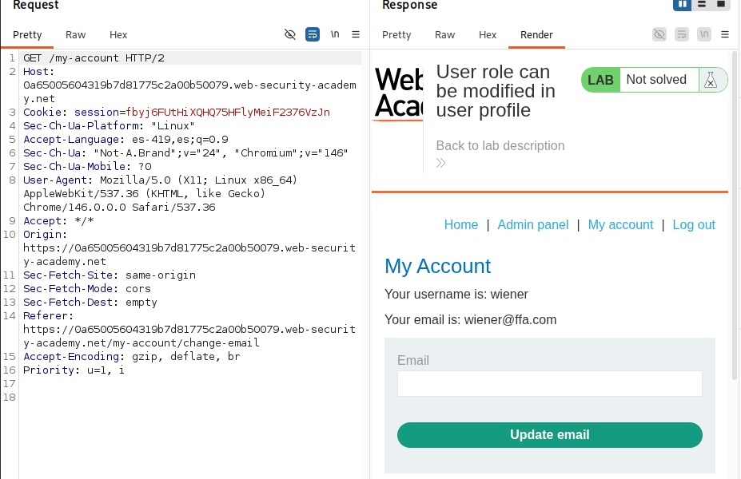
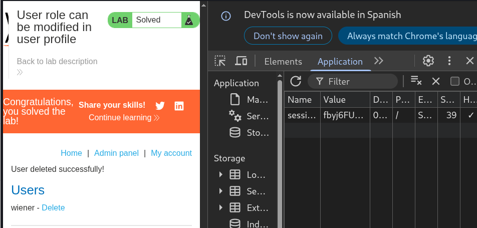

# Lab: User role can be modified in user profile

## Objetivo

Acceder al panel administrativo para eliminar al usuario carlos

## Información dada

* Panel administrativo accecible solo por usuarios con roleid=2
* Credenciales -> wiener:peter

## Reconocimiento

La pagina de `/my-account` disponia de la funcionalidad para la actulizacion de correo. Dicha funcionalidad realizaba un peticion POST que tenia como contenido un json con el nuevo email. El servidor respondia con otro json que contenia una serie de datos.

---

## Explotacion

Se probo agregar el valor de `roleid=2` a la peticion. El resultado fue que la pagina ya contaba con un link hacia el panel administrativo:

El acceso a la pagina de `/administrator-panel` no solicito ningun metodo de autenticacion , por lo que se supuso que los datos enviados fueron usados en un metodo similar a patch, donde el rol del usuario tambien cambio

Eliminacion de usuario:

