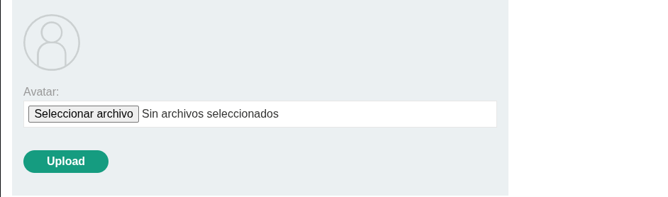
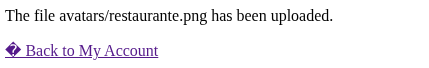
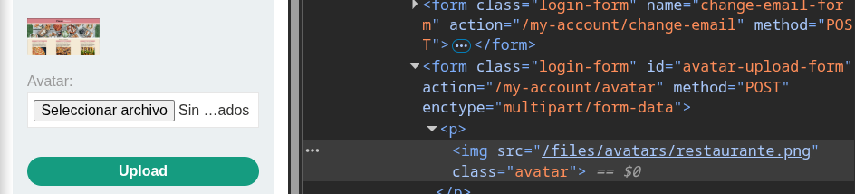
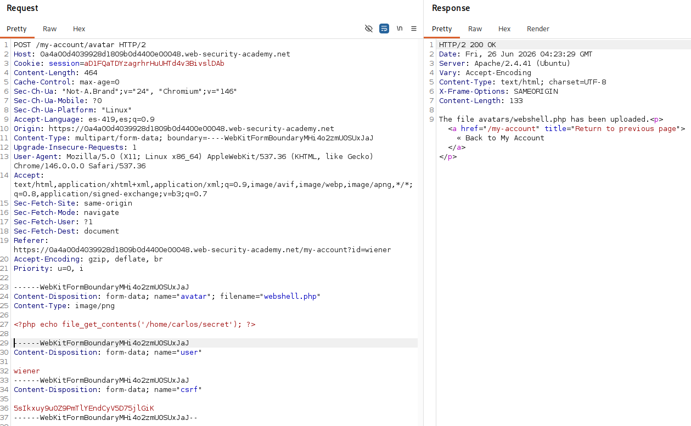
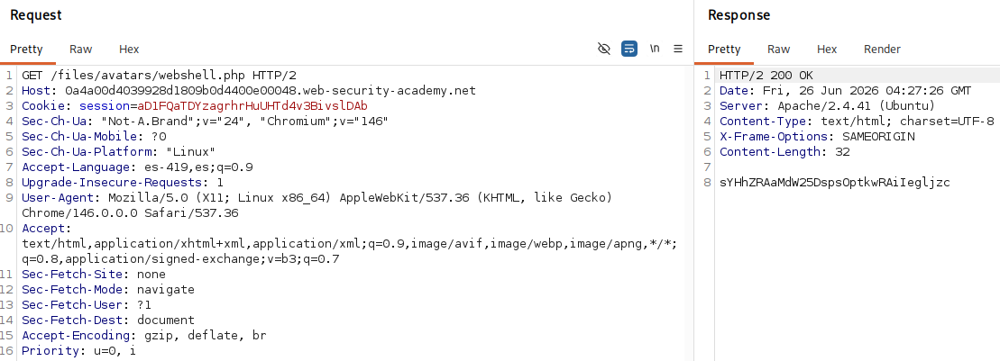

# Lab: Remote code execution via web shell upload

## Información dada

* Vulnerabilidad en la subida de imágenes debido a la falta de validaciones.
* Los archivos subidos se almacenan en el sistema de archivos del servidor.
* Archivo objetivo: `/home/carlos/secret`.
* Credenciales: `wiener:peter`.

---

## Exploración

La página `/my-account` cuenta con una funcionalidad para subir una imagen de perfil.

---

Una vez subida la imagen, se muestra un mensaje indicando parte de la ruta donde fue almacenada (`avatars/<ejemplo.png>`).

---

Al inspeccionar la imagen de perfil, se observa que el archivo subido se sirve desde la ruta `/files/avatars/ejemplo.png`.

---

## Explotacion

Para la explotacion se intercepto la request a travez de burpsuit y se modifico el contenido del campo identificado con el atributo `name="avatar"`. El contenido agregado fue un webshell

---

Una vez subido el WebShell se accedio a la ruta `/files/avatars/webshell.php` y se obtuvo el contenido del archivo objetivo:

