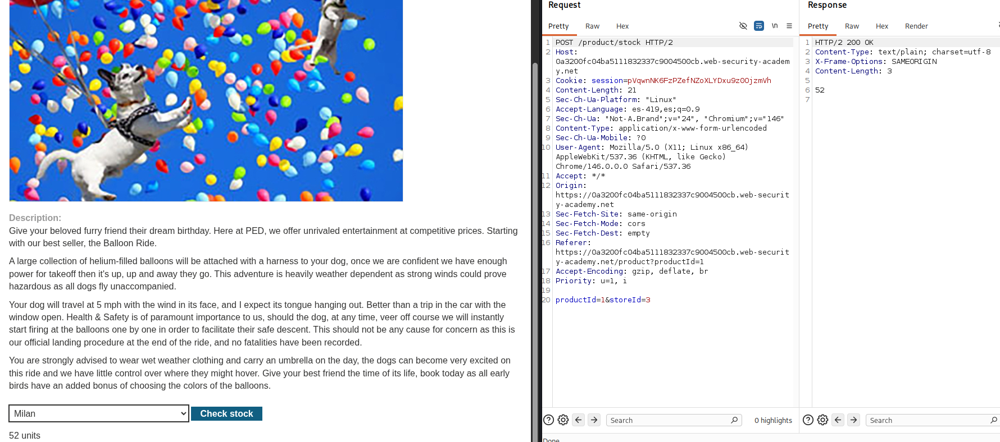
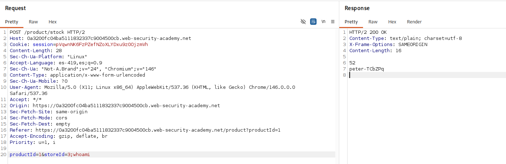
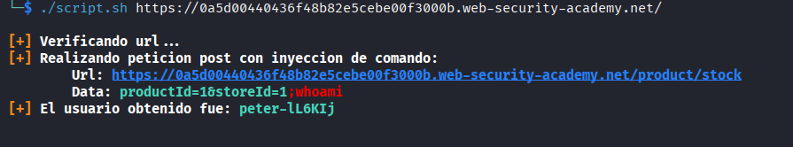

# Lab: OS command injection, simple case

## Objetivo

Confirmar la vulnerabilidad de OS Command Injection y ejecutar el comando `whoami` para identificar el usuario bajo el que se ejecuta el proceso vulnerable.

## Información inicial

* La aplicacion ejecuta un comando de shell utilizando como parametros dos entradas dadas por el usuario


## Reconocimiento

Se identifico la funcionalidad de `Check stock` la cual realiza una solicitud POST con los parametros de `productId` y `storeId`. Dicha funcionlidad retorno el stock del producto indicado



---


## Explotacion

Suponiendo que el parametro de `storeId` era proporcionado como segundo parametro para el script, se inyecto `;whoami`. Esto provoco la obtencion de una segunda linea que contenia el nombre del usuario que ejecuto el script.



## Automatizacion

### Script Bash

Otorgar permisos de ejecucion:
```bash
chmod u+x script.sh
```
Ejecucion:
```bash
./script.sh <url>
```

Ejemplo de uso:

