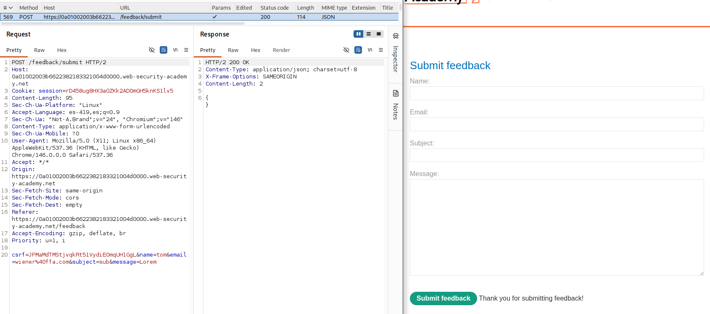
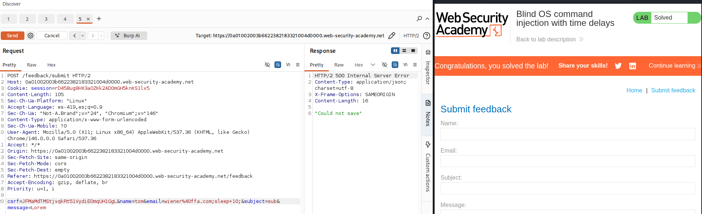

# Lab: Blind OS command injection with time delays

## Objetivo

Confirmar la vulnerabilidad de OS Command Injection al provocar un retraso de 10 segundos en la respuesta

## Información inicial

* La aplicacion ejecuta un comando de shell utilizando informacion proviniente de el usuario

## Reconocimiento

Se identifico la funcionalidad de `Submit feedback` la cual realiza una solicitud POST con una serie de parametros. 

---

## Explotacion

Se probo la inyeccion de `;sleep+10;` en cada parametro hasta que se determino que si se inyectaba en el parametro de `email` la aplicacion tardaba poco mas de 10 segundos en responder

