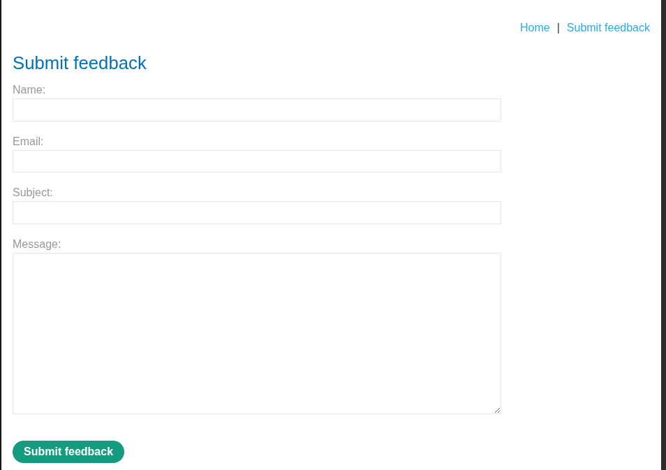
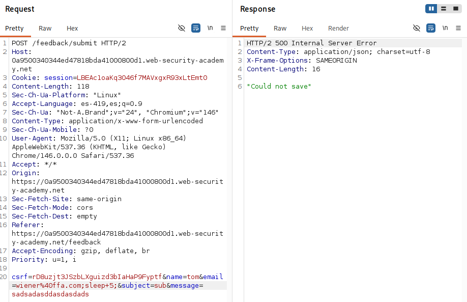
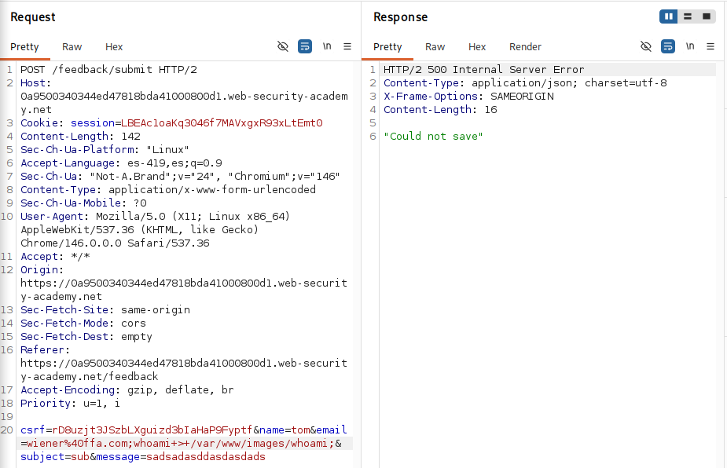
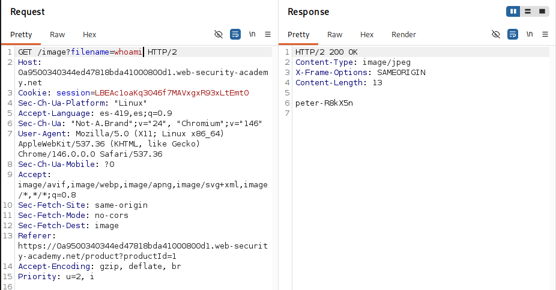

# Blind OS command injection with output redirection

## Objetivo

Obtener la salida del comando whoami

## Información inicial

* La aplicacion ejecuta un comando de shell utilizando informacion proviniente de el usuario
* El usuario que ejecuta el script tiene permisos de escritura sobre el directorio `/var/www/images`

## Reconocimiento

Se identifico la funcionalidad de `Submit feedback` la cual realiza una solicitud POST con una serie de parametros. 

---

## Explotacion

Para identificar junto a que parametro era efectiva la inyeccion, se inyecto `;sleep 5;` junto al valor de cada parametro hasta que se identifico que el retraso de 5 segundos se efectuaba cuando el comando se inyectaba en el parametro de `email`

Una vez identificado el punto de inyeccion, se redirigio la salida del comando `whoami` a un archivo dentro del directorio `/var/www/images` para su posterior visualizacion.

Usuario obtenido:

