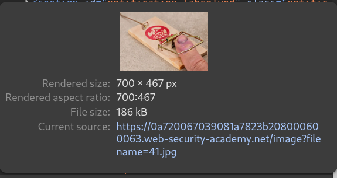
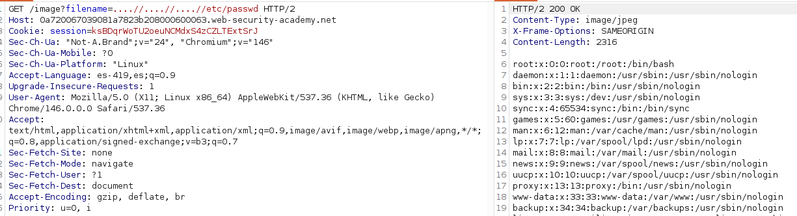
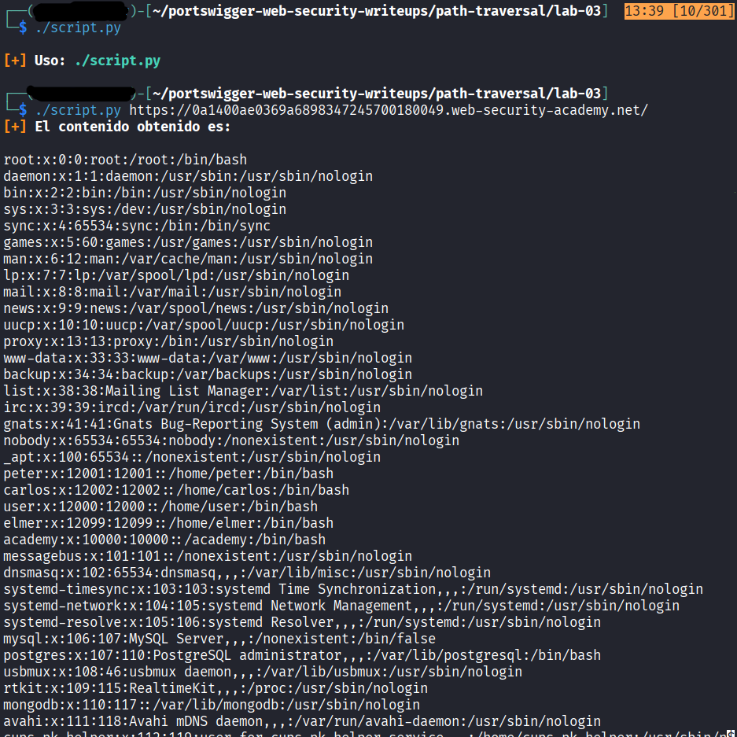

# Lab: File path traversal, traversal sequences stripped non-recursively

## Información dada

* Vulnerabilidad en la muestra de las imagenes de productos
* La aplicacion elimina secuencias de ruta traversal de la entrada dada por el usuario
* Archivo objetivo: `/etc/passwd`.

---

## Exploración

Las imagenes se sirven atravez del endpoint `/image` utilizando el parametro `filename`

---

## Explotacion

La aplicacion elimina secuencias de ruta traversal; sin embargo, no lo hace de forma recursiva, por lo que, si se anidan secuencias, al eliminar las secuencias visibles se generaran otras

---

## Script de Explotacion 

### Ejemplo de uso

