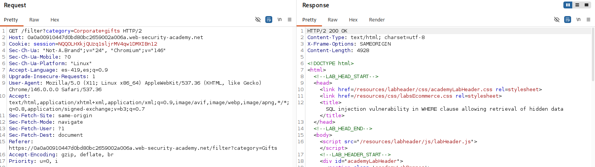
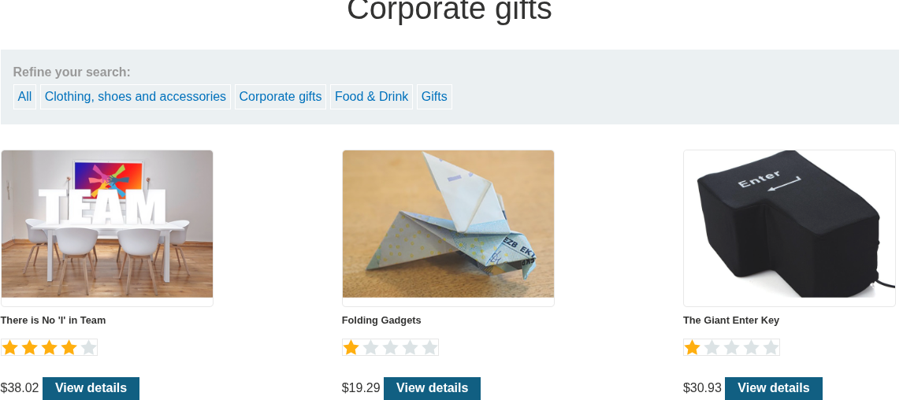
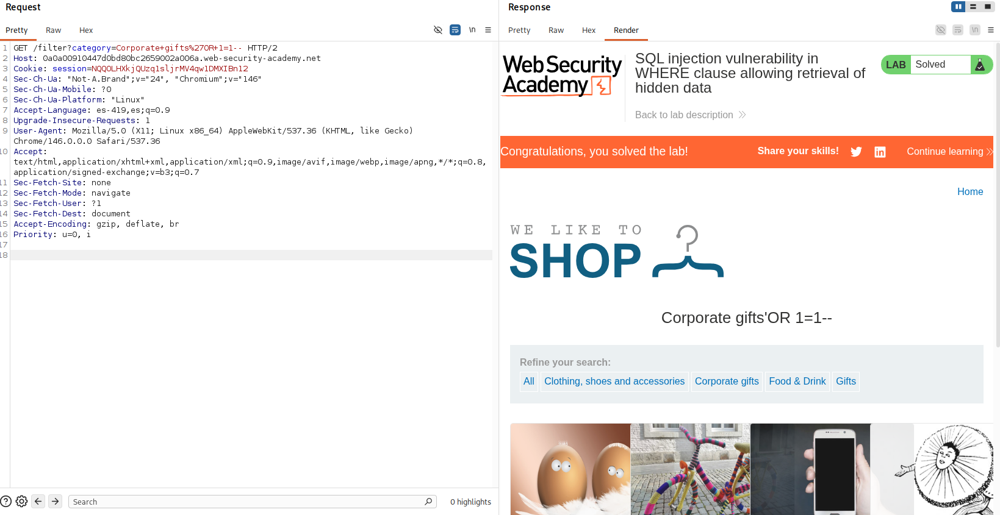
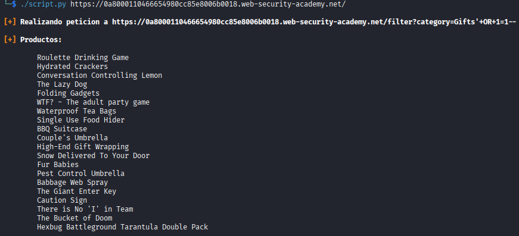

# Lab: SQL injection vulnerability in WHERE clause allowing retrieval of hidden data

## Información dada

* Vulnerabilidad en el filtro de categoria de productos.
* La aplicacion lleva a cabo la consulta:
    ````
    SELECT * FROM products WHERE category = '<categoria>' AND released = 1
    ````
* Objetivo: Mostrar productos no lanzados a la venta .

---

## Exploración

Al seleccionar una categoría de productos, se realiza un peticion al endpoint `/filter`, enviando el parametro `category` con el nombre de la categoria de los productos que se quieren visualizar



---


## Explotacion

Teniendo en cuenta la consulta conocida:
````
SELECT * FROM products WHERE category = '<categoria>' AND released = 1
````
Solo se tiene que modificar el valor enviado en el parametro `category`, agregando una comilla seguida de dos guiones para comentar la segunda condicion y, de esta forma, mostrar todos los productos incluidos los no lanzados. 




## Script de explotacion

Otorgar permisos de ejecucion
```bash
chmod u+x script.py
```
Uso:
```bash
./script.py <url>
```
Ejemplo:



