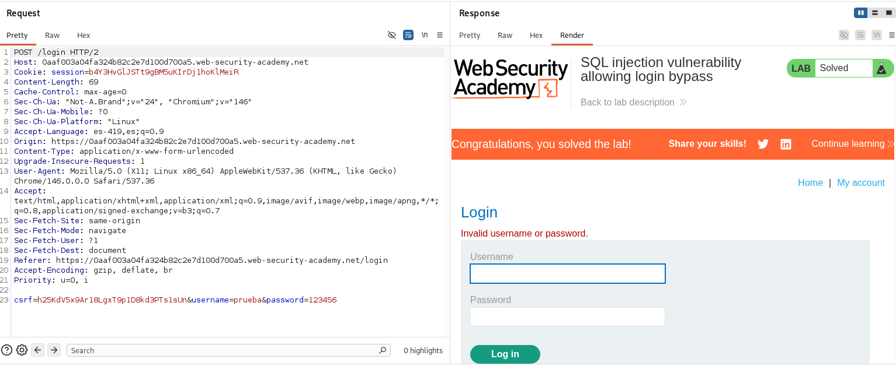
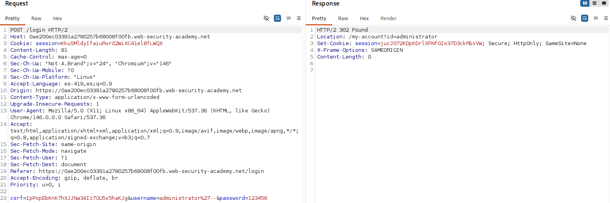
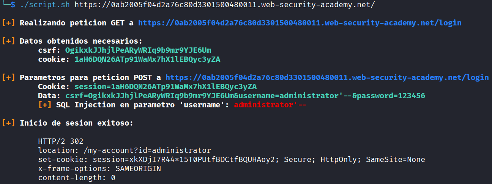

# Lab: SQL injection vulnerability allowing login bypass

## Información dada

* Vulnerabilidad en la funcion de login.
* Usuario `administrator`

## Exploración

La pagina `/login` cuenta con una panel para el inicio de sesion.

Para el inicio de sesion, se realiza una peticion mediante el metodo post, donde se require de una cookie de sesion y los siguientes datos: username,password y csrf



---


## Explotacion

Suponiendo que se realiza una consulta de la forma:
````
SELECT * FROM users WHERE username = '<user>' AND password = '<pass>'
````
Solo se tiene que modificar el valor enviado en el parametro `username`, agregando una comilla seguida de dos guiones para comentar la segunda condicion.





## Scripts de explotacion automatizados

### Script bash
Otorgar permisos de ejecucion
```bash
chmod u+x script.sh
```
Uso:
```bash
./script.sh <url>
```
Ejemplo:



