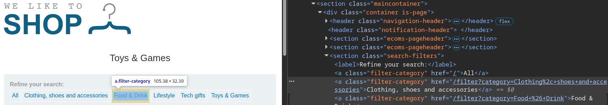
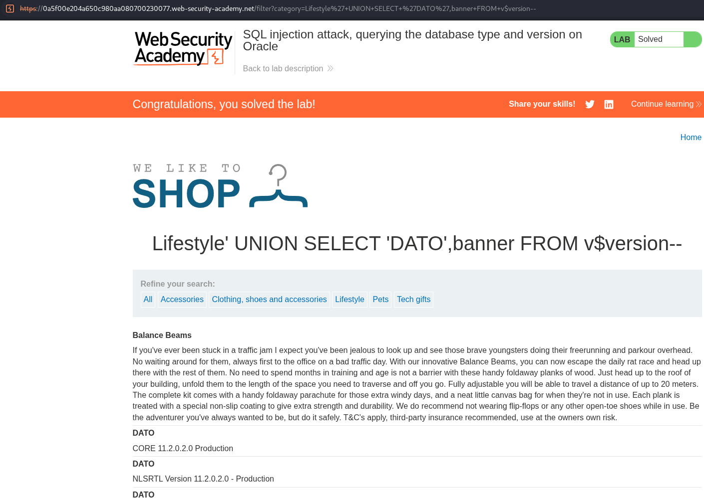

# Lab: SQL injection attack, querying the database type and version on Oracle

## Información dada

* Vulnerabilidad sql injection en el filtro de categoria de productos.
* Objetivo: Obtener version de base de datos

## Exploración

La pagina cuenta con una serie de enlaces que recargan la pagina para mostrar los productos de la categoria seleccionada. Dichos enlaces realizan una peticion al endpoint `filter` usando el parametro `category`

---

## Explotacion

Para determinar la cantidas de columnas tomadas en la consulta, se inyecto `'+ORDER+BY+N--` , y se incremento `N`, hasta que hubo un cambio en el comportamiento de la pagina. Se determino que fueron 2 columnas.

Para determinar el motor de base de datos, se inyectó `'+UNION+SELECT+NULL,NULL--` con el objetivo de comprobar si el backend utilizaba MySQL o MariaDB. Sin embargo, la aplicación devolvió un Internal Server Error. Posteriormente, se modificó la inyección suponiendo que el motor era Oracle, utilizando la carga `'+UNION+SELECT+NULL,NULL+FROM+DUAL--`. Dado que esta última fue procesada correctamente, se concluyó que el motor de base de datos era Oracle.

Para la obtencion de la version se consulto la tabla `v$version` inyectando: `Lifestyle%27+UNION+SELECT+%27DATO%27,banner+FROM+v$version--`

