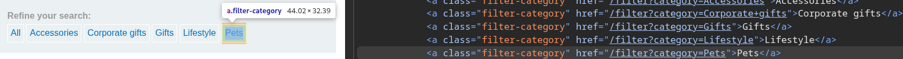
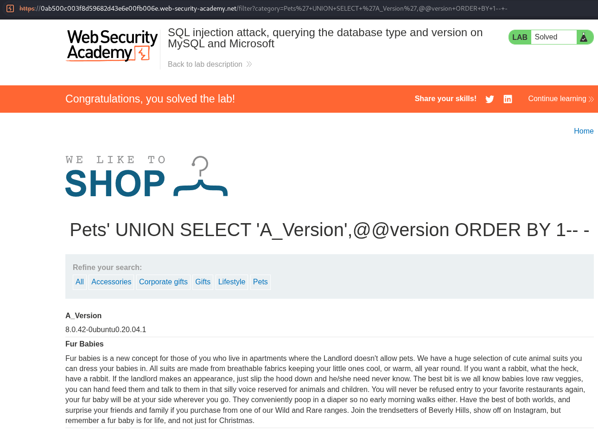
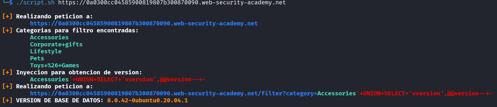

# Lab: SQL injection attack, querying the database type and version on MySQL and Microsoft

## Información dada

* Vulnerabilidad sql injection en el filtro de categoria de productos.
* Objetivo: Obtener version de base de datos

## Exploración

La pagina cuenta con una serie de enlaces que recargan la pagina para mostrar los productos de la categoria seleccionada. Dichos enlaces realizan una peticion al endpoint `filter` usando el parametro `category`




---


## Explotacion

La aplicación no aceptaba inyecciones de la forma `pets'--`, pero sí aceptaba inyecciones de la forma `pets'-- -`, por lo que se dedujo que el motor de base de datos utilizado era MySQL.

Para determinar la cantidas de columnas tomadas en la consulta, se inyecto `'+ORDER+BY+N--+-` , y se incremento `N`, hasta que hubo un cambio en el comportamiento de la pagina. Se determino que fueron 2 columnas.


Para la obtencion de la version, se consulto la variable `@@version` inyectando `Pets'+UNION+SELECT+'A_Version',@@version+ORDER+BY+1--+-`





## Scripts de explotacion

### Script Bash

Otorgar permisos de ejecucion:
```bash
chmod u+x script.sh
```
Uso:
```bash
./script.sh <url>
```

Ejemplo:

