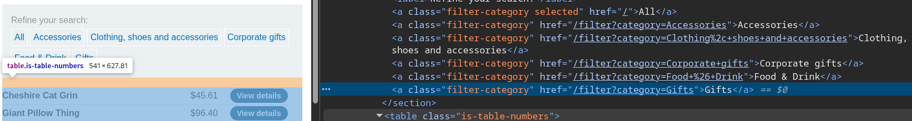
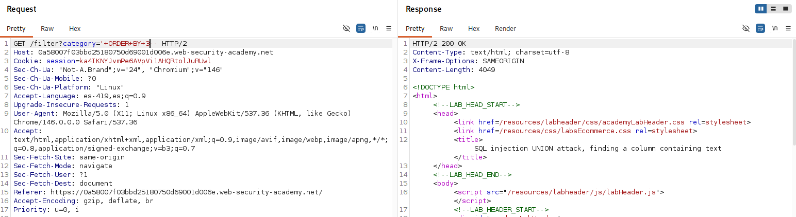
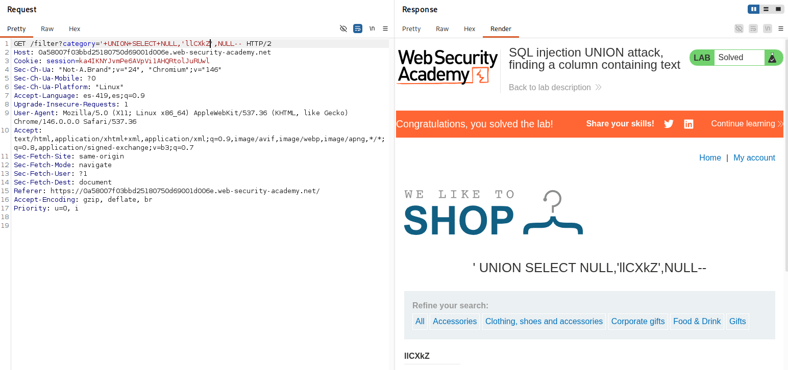

# Lab: SQL injection UNION attack, finding a column containing text

## Objetivo
Determinar que columnas son compactibles con datos string

## Información dada

* Vulnerabilidad sql injection en el filtro de categoria de productos.

## Exploración

La pagina cuenta con una serie de enlaces que recargan la pagina para mostrar los productos de la categoria seleccionada. Dichos enlaces realizan una peticion al endpoint `filter` usando el parametro `category`

---

## Explotacion

La aplicación acepto la inyeccion de la forma `'--`, por lo que se descarto que el motor de bdd usado fuera MySQL

Para determinar la cantidas de columnas tomadas en la consulta, se inyecto `'+ORDER+BY+N--` , y se incremento `N`, hasta que hubo un cambio en el comportamiento de la pagina. Se determino que fueron 3 columnas.

La aplicación acepto la inyeccion de la forma `'+UNION+SELECT+NULL,'llCXkZ',NULL--`, por lo que se determino que el segundo campo es compactible con datos de tipo string 

