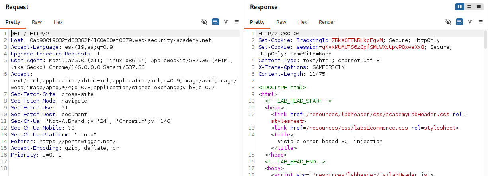
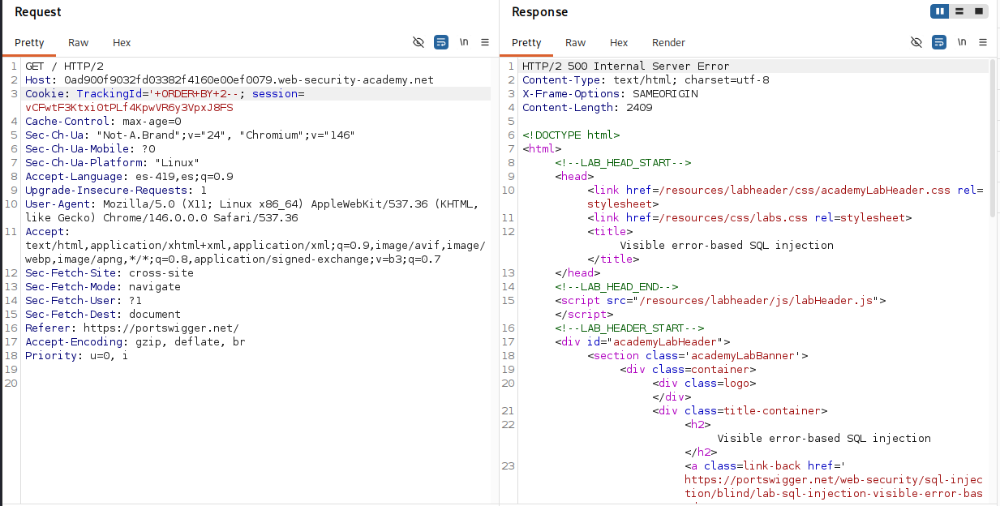
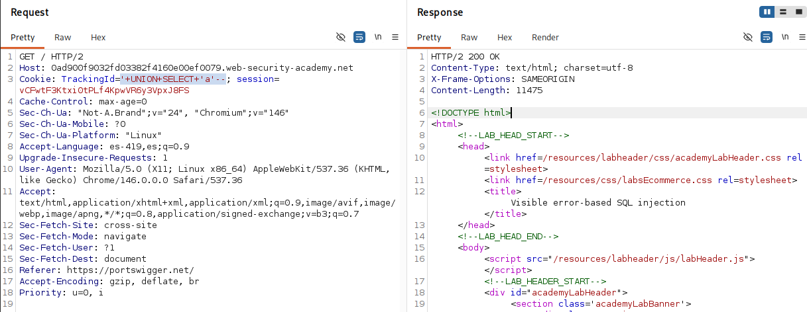
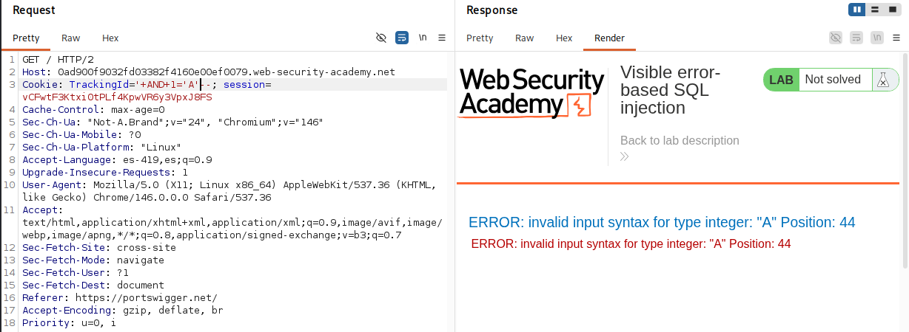
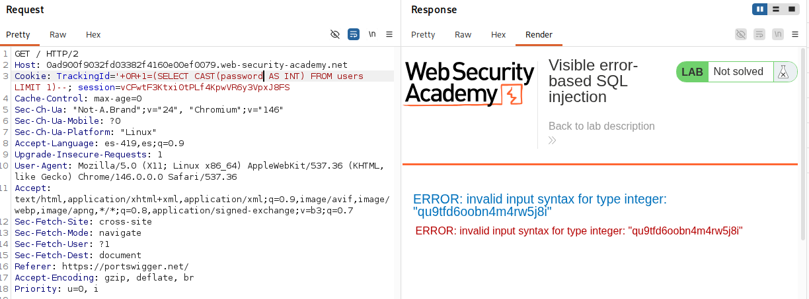
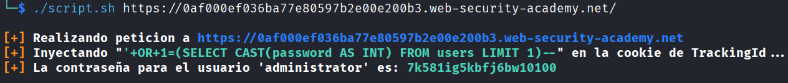

# Lab: Visible error-based SQL injection 

## Objetivo
Obtener la contraseña del usuario administrator.

## Información dada

* La cookie de seguimiento es usada en la consulta sql
* Tabla 'users' con las columnas de username y password.
*  Si la consulta causa un error, se retorna un mensaje de error


## Exploración


La pagina proporciona cookies de sesion y seguimiento. 



---


## Explotacion

Se agrego una comilla simple al final de la cookie 'TrackingId'. Esto provoco que se mostrara el mensaje de: 'Unterminated string literal started at position 36...' . Despues se agrego `'--` y no se noto algun cambio en la pagina


Para determinar la cantidas de columnas tomadas en la consulta, se inyecto `'+ORDER+BY+N--` , y se incremento `N`, hasta que hubo un cambio en el comportamiento de la pagina. Se determino que la consula solo uso una columna




Para determinar el tipo de dato compatible con la columna consultada se inyecto  `'+UNION+SELECT+'a'--`.. Al no obtener un nuevo mensaje de error se determino que el el tipo de dato tomada en la consulta era del tipo VARCHAR




El acceso a la tabla `users` se confirmo al no visualizar ningun mensaje de error despues de realizar la inyeccion:
```
'+UNION+SELECT+username+FROM+users--
``` 


La aplicacion mostro directamente los mensajes de error retornados por el gestor de base de datos. Esto permitio visualizar los causantes de los errores:



Pala la obtencion de la contraseña se inyecto `'+OR+1=(SELECT CAST(password AS INT) FROM users LIMIT 1)--`



Contraseña obtenida: qu9tfd6oobn4m4rw5j8i


## Scripts de explotacion

### Script Bash

Otorgar permisos de ejecucion:
```bash
chmod u+x script.sh
```
Uso:
```bash
./script.sh <url>
```

Ejemplo:

