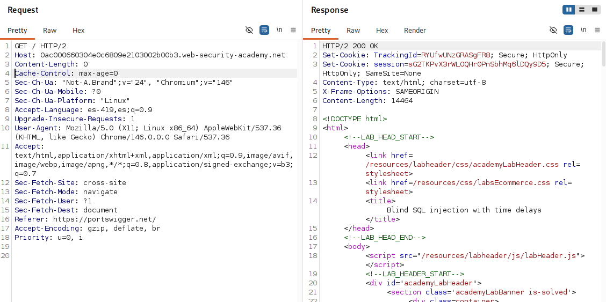
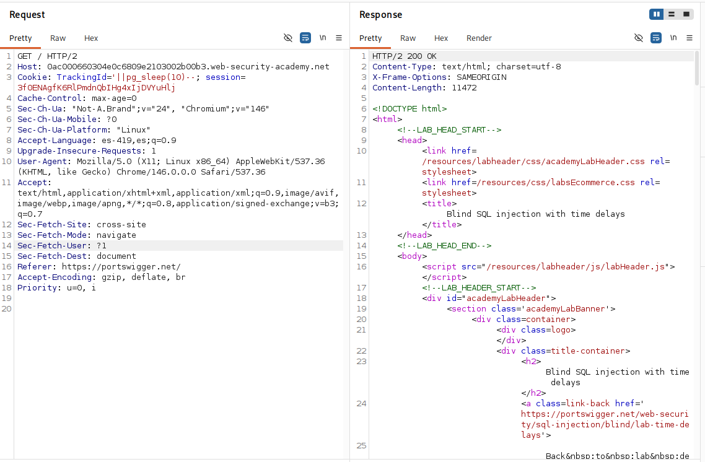

# Lab: Blind SQL injection with time delays

## Objetivo
Causar un retraso de 10 segundos en la respuesta

## Información dada

* La cookie de seguimiento es usada en la consulta sql
* La consulta sql se ejecuta de forma sincrona con la respuesta http

## Exploración

La pagina proporciona cookies de sesion y seguimiento. 

---

## Explotacion

Se provaron las distintas funciones de retraso correspondientes a cada gestor de bases de datos. El retraso se efectuo con la inyeccion `'||pg_sleep(10)--`, por lo que se determino que el gestor de base de datos usado fue el de postgreSQL

